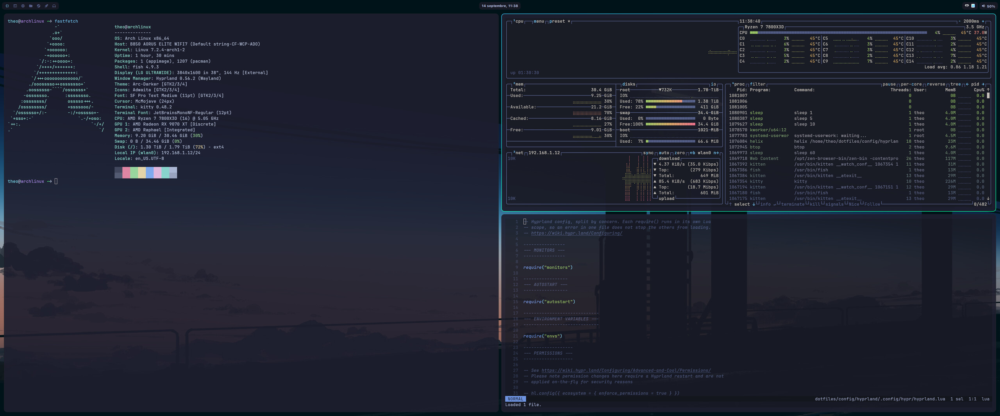
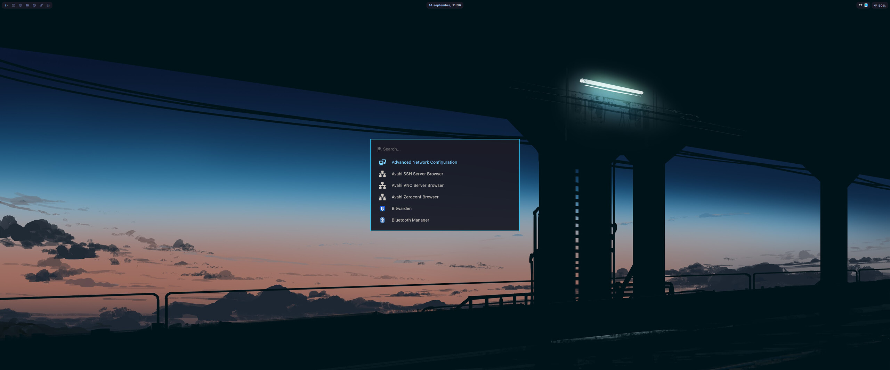

# dotfiles

Everything needed to rebuild my Arch Linux desktop running Hyprland: user dotfiles, system files under `/etc`, package lists for eight package managers, and a Makefile that provisions, audits and cleans the machine.



> [!WARNING]
> This is a personal setup for one machine: AMD CPU, Realtek RTL8922AE Wi-Fi, LG ultrawide, French keyboard.
> Several files hardcode `/home/theo` and expect the repo at `~/dotfiles`.
> Borrow freely, but read before running `make setup` elsewhere: it overwrites files in `/etc`.

## What's inside

| Path | Contents |
| --- | --- |
| [`config/`](config) | One [GNU Stow](https://www.gnu.org/software/stow/) package per program, symlinked into `~` |
| [`system/`](system) | Files installed under `/` as root: boot, initramfs, locales, pacman, networking, Bluetooth, SDDM, keyd |
| [`packages/`](packages) | Package lists for pacman, AUR, npm, pnpm, pip, cargo, go and composer |
| [`services.txt`](services.txt) | System units enabled beyond their vendor preset |
| [`system-ignore.txt`](system-ignore.txt) | `/etc` paths deliberately left out of the repo, each with a reason |
| [`Makefile`](Makefile) | Provision, capture, audit and clean the machine; `make help` lists every target |
| [`tools/`](tools) | Helpers for the Makefile, such as the `make help` renderer |

The desktop itself:

- **Hyprland** with hypridle, hyprlock, hyprsunset and a wallpaper that rotates every 30 minutes
- **Waybar**, the **Walker** launcher with Elephant providers, and **dunst** notifications
- **kitty**, **fish** and **helix**, plus lazygit, btop and fzf
- **Mac-style shortcuts** through keyd, with Ctrl and Command swapped
- **Calendars** synced by vdirsyncer, shown in khal, with desktop notifications
- **Hardware extras**: an OpenRGB profile at boot, the Thermalright LCD, AirPods kept as the default audio sink
- **Boot**: Plymouth `motion` theme and the SDDM `silent` theme with an on-screen keyboard



## Quickstart

### Prerequisites

- A base Arch install with network access, a user in the `wheel` group, and `git` and `base-devel` installed
- [yay](https://github.com/Jguer/yay), which `make` uses for AUR packages:

  ```bash
  git clone https://aur.archlinux.org/yay.git /tmp/yay
  cd /tmp/yay && makepkg -si
  ```

- The secret files that some configs read, which never go in the repo:

  | File | Used by |
  | --- | --- |
  | `~/.secrets/airpods` | `make dotfiles`, to generate the WirePlumber AirPods rule |
  | `~/.secrets/icloud.env` | vdirsyncer, iCloud calendar |
  | `~/.secrets/google_hartprint.env` | vdirsyncer, Google calendar |

  `~/.secrets/airpods` holds a single line: `AIRPODS_MAC="XX:XX:XX:XX:XX:XX"`.

### Install

```bash
git clone https://github.com/Androlax2/dotfiles.git ~/dotfiles
cd ~/dotfiles
make setup
```

`make setup` runs these targets in order, and each one can also be run on its own:

1. `packages` installs the pacman and AUR packages
2. `dotfiles` links every `config/` package into `~`
3. `global-packages` installs the npm, pnpm, pip, cargo, go and composer packages
4. `system` copies `system/` into `/` as root
5. `locale` generates the locales enabled in `/etc/locale.gen`
6. `services` enables the units in `services.txt`
7. `initramfs` rebuilds the initramfs for the Plymouth hooks

Then finish the [manual steps](#manual-steps) and reboot.

### Verify

```bash
make check
```

Each section should be empty. Anything listed is drift between the machine and the repo.

## Everyday use

```bash
make update   # upgrade pacman and AUR packages
make check    # what changed on this machine that the repo doesn't know about?
make dump     # write those changes into the repo, then review them with git diff
make disk     # where is the disk space going?
make clean    # remove orphans, old package caches, dev tool caches, journal older than 4 weeks
```

`make clean` asks before removing packages. Two cleanups stay separate because they destroy data:

```bash
make clean-docker   # stopped containers, unused images, and every unused volume with its data
make clean-trash    # empty the desktop trash for good
```

### Keeping the repo in sync

After installing something or editing a config, run `make check`, then `make dump`, and commit what `git diff` shows.

`make dump` rewrites the package lists, `services.txt` and the files already in `system/`.
It never picks up a new `/etc` file by itself. `make check` lists those instead, and each one needs a decision:

- **Track it** by copying it into `system/` at the same path:

  ```bash
  install -D -m 644 /etc/foo/bar.conf system/etc/foo/bar.conf
  ```

- **Ignore it** by adding a regex and the reason to `system-ignore.txt`.

`.pacnew` files and editor leftovers are never ignored: merge or delete them.

### Adding a program's config

Move its config into a new stow package, then relink:

```bash
mkdir -p config/foo/.config
mv ~/.config/foo config/foo/.config/
make dotfiles
```

Don't stow files that programs rewrite by replacing them, such as `mimeapps.list`: the program replaces the symlink with a plain file.

## Manual steps

These can't be automated safely, so they stay manual.

### Boot parameters

Plymouth needs `quiet splash` on the kernel command line.
Loader entries contain the disk's PARTUUID, so they are not versioned:

```bash
sudoedit /boot/loader/entries/<date>_linux.conf
```

```text
options root=PARTUUID=... quiet splash
```

### Fonts

`system/` only tracks regular files, so the fontconfig links are created by hand:

```bash
sudo ln -s /usr/share/fontconfig/conf.avail/10-sub-pixel-rgb.conf /etc/fonts/conf.d/
sudo ln -s /usr/share/fontconfig/conf.avail/10-hinting-slight.conf /etc/fonts/conf.d/
sudo ln -s /usr/share/fontconfig/conf.avail/10-autohint.conf /etc/fonts/conf.d/
sudo ln -s /usr/share/fontconfig/conf.avail/11-lcdfilter-default.conf /etc/fonts/conf.d/
sudo ln -s /usr/share/fontconfig/conf.avail/75-apple-color-emoji.conf /etc/fonts/conf.d/
sudo fc-cache -fv
```

Don't enable `70-no-bitmaps.conf` or any other config that disables embedded bitmaps. Color emoji fonts such as Apple Color Emoji rely on them.

### Wi-Fi (RTL8922AE)

The `rtw89_8922ae` driver stalls when the access point changes channel or bandwidth.
Traffic stops, but the driver never reports a disconnect, so NetworkManager keeps showing the link as connected.

1. **Stop the Livebox from hopping channels.** On `http://192.168.1.1`, open Wi-Fi, then the 5 GHz advanced settings:
   - Fix the channel to 36, 40, 44 or 48, which avoid radar (DFS) channels.
   - Set the width to 80 MHz, because 160 MHz spans DFS channels and forces moves.
   - Turn off any smart channel or channel optimisation option.
2. **Let the PC recover on its own.** `make system` installs a NetworkManager dispatcher script that power-cycles the radio whenever the connectivity check fails while `wlan0` still claims to be connected. It also installs a module config that disables PCIe and driver power saving.

Check that the recovery works, and that the regulatory database loaded after a reboot:

```bash
journalctl -t wifi-reconnect
iw reg get   # should show "country FR", not "country 00"
```

### Software installed outside package managers

These came from vendor installers, so `make` can't reinstall them:

| Software | Location | Notes |
| --- | --- | --- |
| Claude Code | `~/.local/bin/claude` | Updates itself |
| CodeRabbit CLI | `~/.local/bin/coderabbit` | `cr` is a symlink to it |
| greywall, greyproxy | `~/.local/bin` | The `opencode` wrapper in `config/bin` runs through greywall; greyproxy is a user service |
| opencode | `~/.opencode/bin` | Started through `~/.local/bin/opencode` |
| Herd Lite | `~/.config/herd-lite` | PHP, Composer and the Laravel installer, added to `PATH` by `~/.profile` |
| uv | `/usr/local/bin` | `make clean-caches` uses it |
| Private Internet Access | `/opt/piavpn` | Its installer also writes `piavpn.service` and `wgpia.conf` |
| Thermalright LCD control | `/usr/local/bin` | Its unit file is versioned in `system/` |

## Notes

- **DNS** goes through systemd-resolved with Quad9 and Cloudflare, set in [`system/etc/systemd/resolved.conf`](system/etc/systemd/resolved.conf). NetworkManager hands DNS over to it through [`dns.conf`](system/etc/NetworkManager/conf.d/dns.conf).
- **User services and timers** are versioned with their enable links in [`config/systemd`](config/systemd/.config/systemd/user), so `make dotfiles` enables them too.
- **The wallpaper** is picked by `wallpaper-rotator.sh`, which writes `~/.config/hypr/wallpaper.conf`. That file is git-ignored because it changes every 30 minutes.
