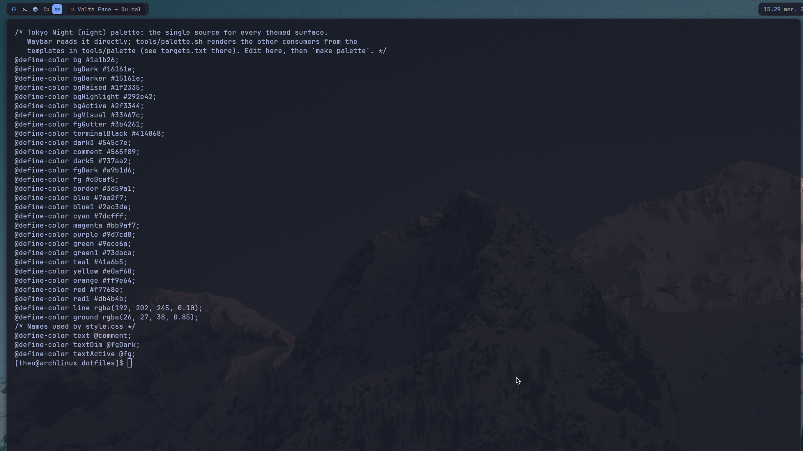
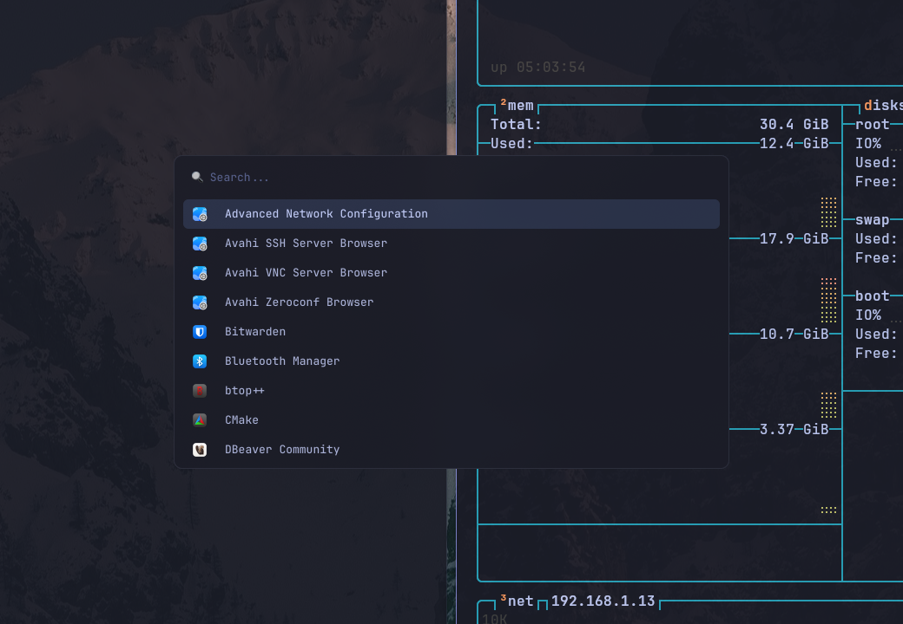
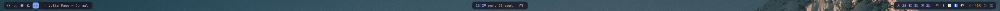
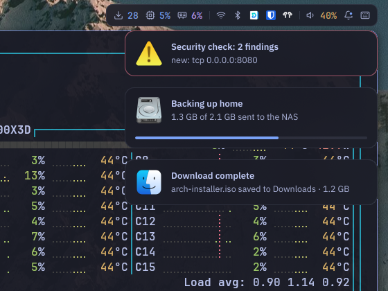
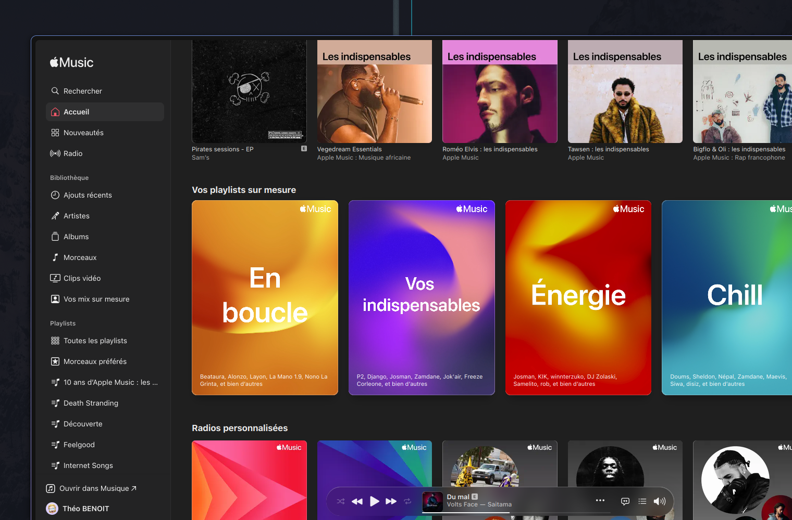

# dotfiles

Everything needed to rebuild my Arch Linux desktop running Hyprland: user dotfiles, system files under `/etc`, package lists for eight package managers, and a Makefile that provisions, audits and cleans the machine.



> [!WARNING]
> This is a personal setup for one machine: AMD CPU, Realtek RTL8922AE Wi-Fi, LG ultrawide, French keyboard.
> Several files hardcode `/home/theo` and expect the repo at `~/dotfiles`.
> Borrow freely, but read before running `make setup` elsewhere: it overwrites files in `/etc`.

## What's inside

| Path | Contents |
| --- | --- |
| [`config/`](config) | One [GNU Stow](https://www.gnu.org/software/stow/) package per program, symlinked into `~` |
| [`system/`](system) | Files installed under `/` as root: boot, initramfs, locales, pacman, networking, Bluetooth, SDDM, keyd |
| [`packages/`](packages) | Package lists for pacman, AUR, npm, pnpm, pip, cargo, go and composer |
| [`services.txt`](services.txt) | System units enabled beyond their vendor preset |
| [`system-ignore.txt`](system-ignore.txt) | `/etc` paths deliberately left out of the repo, each with a reason |
| [`Makefile`](Makefile) | Provision, capture, audit and clean the machine; `make help` lists every target |
| [`tools/`](tools) | Helpers for the Makefile: the `make help` renderer, the palette generator, the security check, the README screenshots |

The desktop itself:

- **Hyprland** with hypridle, hyprlock, hyprsunset and a wallpaper that rotates every 30 minutes
- **Waybar**, the **Walker** launcher with Elephant providers, and **swaync** notifications
- **kitty**, **fish** and **helix**, plus lazygit, btop, fzf, bat, delta, yazi and tmux, all on the same palette
- **Mac-style shortcuts** through keyd, with Ctrl and Command swapped
- **Calendars** synced by vdirsyncer, shown in khal, with desktop notifications
- **Hardware extras**: an OpenRGB profile at boot, the Thermalright LCD, AirPods kept as the default audio sink
- **Boot**: Plymouth `motion` theme and the SDDM `silent` theme with an on-screen keyboard



## Design

One palette, Tokyo Night (night), applied the same way everywhere:

- **Tokens** live in [`config/waybar/.config/waybar/colors.css`](config/waybar/.config/waybar/colors.css). `make palette` renders kitty, GTK, qt6ct, swaync, Walker, Hyprland, fish, lazygit, fzf, btop, the OSD, slurp and Zen from the templates in [`tools/palette`](tools/palette); `make check-palette` reports drift.
- **Ground** `#1a1b26` at 85 % behind blurred islands, a `rgba(192, 202, 245, 0.10)` hairline, radius 10.
- **Icons are muted** (`#a9b1d6`), **values carry the colour**: blue for CPU, purple for GPU, yellow for volume, red for recording.
- **One colour family per element**, no gradients across families.
- **The grid**: 15 px outer gaps, 6 px between the bar and the windows, 8 px between islands.
- **Type**: JetBrainsMono Nerd Font in the bar and terminals, IBM Plex Sans in notifications.








## Keybindings

`Super` is the physical Command key: keyd swaps it with Ctrl, so Hyprland sees these as `CTRL`. `Super + Ctrl + K` (or the keyboard icon at the end of the bar) shows this list on screen, and choosing an entry runs it; it comes from `hyprctl binds` and the `description` of each bind in [`bindings.lua`](config/hyprland/.config/hypr/bindings.lua).

| Keys | Action |
| --- | --- |
| `Alt + 0` | Workspace 10 |
| `Alt + 1` | Workspace 1 |
| `Alt + 2` | Workspace 2 |
| `Alt + 3` | Workspace 3 |
| `Alt + 4` | Workspace 4 |
| `Alt + 5` | Workspace 5 |
| `Alt + 6` | Workspace 6 |
| `Alt + 7` | Workspace 7 |
| `Alt + 8` | Workspace 8 |
| `Alt + 9` | Workspace 9 |
| `Alt + F` | Fullscreen |
| `Alt + G` | Game mode (eye candy off) |
| `Alt + J` | Toggle window split |
| `Alt + Q` | Terminal |
| `Alt + Scroll down` | Next workspace |
| `Alt + Scroll up` | Previous workspace |
| `Alt + Shift + 0` | Move window to workspace 10 |
| `Alt + Shift + 1` | Move window to workspace 1 |
| `Alt + Shift + 2` | Move window to workspace 2 |
| `Alt + Shift + 3` | Move window to workspace 3 |
| `Alt + Shift + 4` | Move window to workspace 4 |
| `Alt + Shift + 5` | Move window to workspace 5 |
| `Alt + Shift + 6` | Move window to workspace 6 |
| `Alt + Shift + 7` | Move window to workspace 7 |
| `Alt + Shift + 8` | Move window to workspace 8 |
| `Alt + Shift + 9` | Move window to workspace 9 |
| `Alt + Shift + H` | Toggle HDR |
| `Alt + Shift + S` | Scratch workspace |
| `Alt + Shift + TAB` | Previous workspace |
| `Alt + TAB` | Next workspace |
| `Alt + W` | Close window |
| `Ctrl + down` | Focus down |
| `Ctrl + left` | Focus left |
| `Ctrl + right` | Focus right |
| `Ctrl + Shift + down` | Move window down |
| `Ctrl + Shift + left` | Move window left |
| `Ctrl + Shift + right` | Move window right |
| `Ctrl + Shift + up` | Move window up |
| `Ctrl + up` | Focus up |
| `Super + ²` | Dropdown terminal |
| `Super + Ctrl + B` | Bluetooth picker |
| `Super + Ctrl + C` | Calculator |
| `Super + Ctrl + E` | Emoji picker |
| `Super + Ctrl + K` | Keybinding cheat sheet |
| `Super + Ctrl + Q` | Power menu |
| `Super + Ctrl + SPACE` | Emoji picker |
| `Super + Ctrl + V` | Clipboard history |
| `Super + Ctrl + W` | Wi-Fi picker |
| `Super + M` | Apple Music |
| `Super + Shift + 3` | Screenshot the monitor |
| `Super + Shift + 4` | Screenshot an area or a window |
| `Super + Shift + 5` | Start / stop recording |
| `Super + SPACE` | Launcher |
| `XF86AudioLowerVolume` | Volume down |
| `XF86AudioMicMute` | Mute the microphone |
| `XF86AudioMute` | Mute |
| `XF86AudioNext` | Next track |
| `XF86AudioPause` | Play / pause |
| `XF86AudioPlay` | Play / pause |
| `XF86AudioPrev` | Previous track |
| `XF86AudioRaiseVolume` | Volume up |
| `XF86MonBrightnessDown` | Brightness down |
| `XF86MonBrightnessUp` | Brightness up |

## Quickstart

### Prerequisites

- A base Arch install with network access, a user in the `wheel` group, and `git` and `base-devel` installed
- [yay](https://github.com/Jguer/yay), which `make` uses for AUR packages:

  ```bash
  git clone https://aur.archlinux.org/yay.git /tmp/yay
  cd /tmp/yay && makepkg -si
  ```

- The secret files that some configs read, which never go in the repo:

  | File | Used by |
  | --- | --- |
  | `~/.secrets/airpods` | `make dotfiles`, to generate the WirePlumber AirPods rule |
  | `~/.secrets/icloud.env` | vdirsyncer, iCloud calendar |
  | `~/.secrets/restic` | Backups: the password of both repositories, see [Backups](#backups) |

  `~/.secrets/airpods` holds a single line: `AIRPODS_MAC="XX:XX:XX:XX:XX:XX"`.

### Install

```bash
git clone https://github.com/Androlax2/dotfiles.git ~/dotfiles
cd ~/dotfiles
make setup
```

`make setup` runs these targets in order, and each one can also be run on its own:

1. `packages` installs the pacman and AUR packages
2. `dotfiles` links every `config/` package into `~`
3. `global-packages` installs the npm, pnpm, pip, cargo, go and composer packages
4. `system` copies `system/` into `/` as root
5. `locale` generates the locales enabled in `/etc/locale.gen`
6. `services` enables the units in `services.txt`
7. `initramfs` rebuilds the initramfs for the Plymouth hooks

Then finish the [manual steps](#manual-steps) and reboot.

### Verify

```bash
make check
```

Each section should be empty. Anything listed is drift between the machine and the repo.

## Everyday use

```bash
make update   # upgrade pacman and AUR packages
make check    # what changed on this machine that the repo doesn't know about?
make dump     # write those changes into the repo, then review them with git diff
make disk     # where is the disk space going?
make clean    # remove orphans, old package caches, dev tool caches, journal older than 4 weeks
```

`make clean` asks before removing packages. Two cleanups stay separate because they destroy data:

```bash
make clean-docker   # stopped containers, unused images, and every unused volume with its data
make clean-trash    # empty the desktop trash for good
```

### Keeping the repo in sync

After installing something or editing a config, run `make check`, then `make dump`, and commit what `git diff` shows.

`make dump` rewrites the package lists, `services.txt` and the files already in `system/`.
It never picks up a new `/etc` file by itself. `make check` lists those instead, and each one needs a decision:

- **Track it** by copying it into `system/` at the same path:

  ```bash
  install -D -m 644 /etc/foo/bar.conf system/etc/foo/bar.conf
  ```

- **Ignore it** by adding a regex and the reason to `system-ignore.txt`.

`.pacnew` files and editor leftovers are never ignored: merge or delete them.

### Adding a program's config

Move its config into a new stow package, then relink:

```bash
mkdir -p config/foo/.config
mv ~/.config/foo config/foo/.config/
make dotfiles
```

Don't stow files that programs rewrite by replacing them, such as `mimeapps.list`: the program replaces the symlink with a plain file.

## Backups

```text
PC ── restic over SFTP, daily ──> NAS share "restic"          (btrfs snapshots, immutable for 7 days)
PC ── restic over SFTP, daily ──> Hetzner Storage Box         (Storage Box snapshots)
NAS ── its own data, nightly, from the homelab repo ──> Hetzner Storage Box
```

- **Two independent copies of the PC.** The NAS and Hetzner each hold a separate restic repository, so losing either one, or the NAS with the house, still leaves a backup.
- **The NAS backs up its own data.** Photos, apps and databases leave the NAS through the [homelab repository](https://github.com/Androlax2/homelab#backups), not from this machine.
- **Encrypted on the PC.** restic encrypts and deduplicates before upload: the NAS and Hetzner only store ciphertext.
- **Everything in `~` is backed up** except the caches, game installs, programs and build output listed in [`excludes.txt`](config/restic/.config/restic/excludes.txt). `make backup-list` shows the size of every included folder, and `make backup-list DEPTH=2` shows fewer levels.
- **One script does the work.** [`backup.sh`](config/restic/.config/restic/backup.sh) runs behind the `make backup*` targets and both timers.

| Job | When | Keeps |
| --- | --- | --- |
| Backup to both, `restic-backup.timer` | 15 minutes after boot, then daily | Every run until maintenance |
| Maintenance on both, `restic-maintenance.timer` | Sundays at 14:00, or at the next boot if missed | 7 daily, 4 weekly and 12 monthly snapshots |
| NAS snapshots of the `restic` share | Daily | 14 days, immutable for 7 |
| Storage Box snapshots | Automatic, set in Hetzner Console | Up to 10 |

A target that can't be reached, away from home or offline, is skipped quietly while the other still runs. After 3 days without a backup to a target you get a notification, and any failure sends a critical one.

> [!CAUTION]
> The backups can't be decrypted without `~/.secrets/restic`. Keep a copy outside the NAS, for example on paper stored away from home: Bitwarden here is the Vaultwarden instance running on the NAS, so it disappears with it.

### First-time setup

On the NAS, in DSM:

1. In Control Panel, open Shared Folder and create `restic` on Volume 1, with data checksum on and read/write access for your account.
2. In Control Panel, open File Services, then FTP, and enable SFTP.
3. In Snapshot Replication, schedule daily snapshots of `restic`, kept 14 days and immutable for 7.

On Hetzner:

4. In Hetzner Console, open the Storage Box and turn on **External Reachability** and **SSH Support**. Without External Reachability, only machines inside Hetzner's network can connect.
5. In the Storage Box's Snapshots tab, turn on automatic snapshots. This machine holds an SSH key to the box, so snapshots are what protect the backups if it is compromised.

On the PC:

6. Install restic and record it in the package list:

   ```bash
   sudo pacman -S restic
   make dump-packages
   ```

7. Generate the repository password, then store a copy outside the NAS:

   ```bash
   (umask 077 && head -c 32 /dev/urandom | base64 > ~/.secrets/restic)
   ```

8. Name the Storage Box `storagebox` in `~/.ssh/config`, with the username from Hetzner Console. Use port 23: there the box accepts the usual one-line OpenSSH key, while port 22 only accepts keys in RFC4716 format:

   ```text
   Host storagebox
       HostName u000000.your-storagebox.de
       Port 23
       User u000000
   ```

   Add this machine's public key, as its one-line `.pub` file, to the box's `.ssh/authorized_keys`. Then connect once to accept its host key, since restic can't answer that prompt:

   ```bash
   sftp storagebox
   ```

9. Create both repositories, check what would be uploaded, then run the first backup. Plug in Ethernet for this one, since it uploads everything twice:

   ```bash
   make backup-init
   ~/.config/restic/backup.sh run --dry-run -v
   make backup
   ```

10. Turn on the schedule:

    ```bash
    systemctl --user enable --now restic-backup.timer restic-maintenance.timer
    ```

### Restoring

Pick the target with `nas` or `hetzner`. They hold the same data, so use the NAS at home, since it's faster:

```bash
make backup-status
~/.config/restic/backup.sh restic nas restore latest --target /tmp/restore --include "$HOME/IdeaProjects/opusline"
```

To browse every snapshot as folders, mount a repository:

```bash
mkdir -p /tmp/restic-mount
~/.config/restic/backup.sh restic nas mount /tmp/restic-mount
```

If the NAS is lost, restore from Hetzner the same way, with `hetzner` as the target.

## Manual steps

These can't be automated safely, so they stay manual.

### Boot parameters

Plymouth needs `quiet splash` on the kernel command line.
Loader entries contain the disk's PARTUUID, so they are not versioned:

```bash
sudoedit /boot/loader/entries/<date>_linux.conf
```

```text
options root=PARTUUID=... quiet splash
```

### Fonts

`system/` only tracks regular files, so the fontconfig links are created by hand:

```bash
sudo ln -s /usr/share/fontconfig/conf.avail/10-sub-pixel-rgb.conf /etc/fonts/conf.d/
sudo ln -s /usr/share/fontconfig/conf.avail/10-hinting-slight.conf /etc/fonts/conf.d/
sudo ln -s /usr/share/fontconfig/conf.avail/10-autohint.conf /etc/fonts/conf.d/
sudo ln -s /usr/share/fontconfig/conf.avail/11-lcdfilter-default.conf /etc/fonts/conf.d/
sudo ln -s /usr/share/fontconfig/conf.avail/75-apple-color-emoji.conf /etc/fonts/conf.d/
sudo fc-cache -fv
```

Don't enable `70-no-bitmaps.conf` or any other config that disables embedded bitmaps. Color emoji fonts such as Apple Color Emoji rely on them.

### Wi-Fi (RTL8922AE)

The `rtw89_8922ae` driver stalls when the access point changes channel or bandwidth.
Traffic stops, but the driver never reports a disconnect, so NetworkManager keeps showing the link as connected.

1. **Stop the Livebox from hopping channels.** On `http://192.168.1.1`, open Wi-Fi, then the 5 GHz advanced settings:
   - Fix the channel to 36, 40, 44 or 48, which avoid radar (DFS) channels.
   - Set the width to 80 MHz, because 160 MHz spans DFS channels and forces moves.
   - Turn off any smart channel or channel optimisation option.
2. **Let the PC recover on its own.** `make system` installs a NetworkManager dispatcher script that power-cycles the radio whenever the connectivity check fails while `wlan0` still claims to be connected. It also installs a module config that disables PCIe and driver power saving.

Check that the recovery works, and that the regulatory database loaded after a reboot:

```bash
journalctl -t wifi-reconnect
iw reg get   # should show "country FR", not "country 00"
```

### Software installed outside package managers

These came from vendor installers, so `make` can't reinstall them:

| Software | Location | Notes |
| --- | --- | --- |
| Claude Code | `~/.local/bin/claude` | Updates itself |
| CodeRabbit CLI | `~/.local/bin/coderabbit` | `cr` is a symlink to it |
| greywall, greyproxy | `~/.local/bin` | The `opencode` wrapper in `config/bin` runs through greywall; greyproxy is a user service |
| opencode | `~/.opencode/bin` | Started through `~/.local/bin/opencode` |
| Herd Lite | `~/.config/herd-lite` | PHP, Composer and the Laravel installer, added to `PATH` by `~/.profile` |
| uv | `/usr/local/bin` | `make clean-caches` uses it |
| Private Internet Access | `/opt/piavpn` | Its installer also writes `piavpn.service` and `wgpia.conf` |
| Thermalright LCD control | `/usr/local/bin` | Its unit file is versioned in `system/` |

## Notes

- **DNS** goes through systemd-resolved with Quad9 and Cloudflare, set in [`system/etc/systemd/resolved.conf`](system/etc/systemd/resolved.conf). NetworkManager hands DNS over to it through [`dns.conf`](system/etc/NetworkManager/conf.d/dns.conf).
- **User services and timers** are versioned with their enable links in [`config/systemd`](config/systemd/.config/systemd/user), so `make dotfiles` enables them too.
- **The wallpaper** is picked by `wallpaper-rotator.sh`, which writes `~/.config/hypr/wallpaper.conf`. That file is git-ignored because it changes every 30 minutes.
